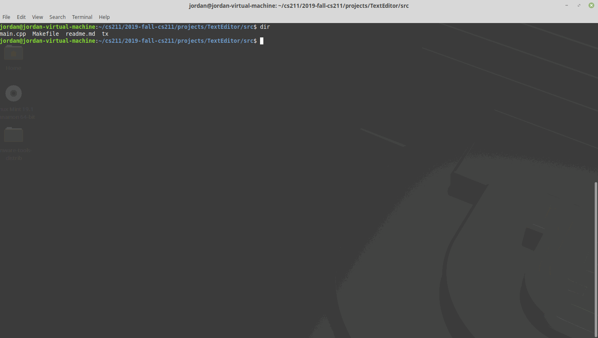

# Design Diary (Milestone 2)

The goal of this milestone is to get the program to parse command line arguments.

Much of this functionality was implemented in Milestone 1, however many changes to this functionality were made in this milestone.

In the previous milestone, a function was written called parse_arguments, which returns a vector<string> containing a list of all of the arguments that were entered. This is received by the init_terminal function, which then actually executes the commands based on which flags the user entered. The only command implemented in Milestone 1 was --help (-h), which simply displayed the usage details and quit.

In this milestone, file parsing and the --hide-gui (-H) flag were added, along with a prototype for the --word-wrap (-W) flag. Currently, the program requires that the user at least enters a file name before the program will start. If they do not, the usage details will print and the program will quit.

The options are parsed first, and removed from the vector<string> containing the arguments as they are processed. Only arguments starting with a '-' character are removed. The last argument in the vector<string> is assumed to be the file name. The program then tries to read that file, if it exists, and will output its contents to the screen. If an unknown argument is found, the program will display that argument as invalid, print the usage details, and quit.
  
The most challenging portion of this milestone was getting the program to correctly read the file. As the document is structured as a vector<string>, this was made considerably easier through the use of the std::getline() and std::vector::push_back() functions. As tabs are not correctly handled yet, these are not properly processed by the terminal and show up only as single spaces, in part due to the column mismatch created by the Tab character, as discussed in Milestone 1.
  
Column overflow will be handled in one of two ways, with the option being given to the user. The default mode will allow for overflow, and the user will be able to navigate each column individually (similar to how NANO allows the user to do this, but ideally without the jumping). The second mode, enabled by the --word-wrap or -W option, will enable word wrapping and cause the text to move to the next line if the column counter overflows. This is currently not implemented, but is in progress as part of the redraw_column function.

A sample of the program running can be found here. This demonstrates command line arguments being parsed and properly executed, namely the hide GUI flag, the help flag, and file loading. It also demonstrates scrolling around a file using the arrow keys, although this functionality is still a work-in-progress, as there is a mismatch between the document vector and the screen. 

